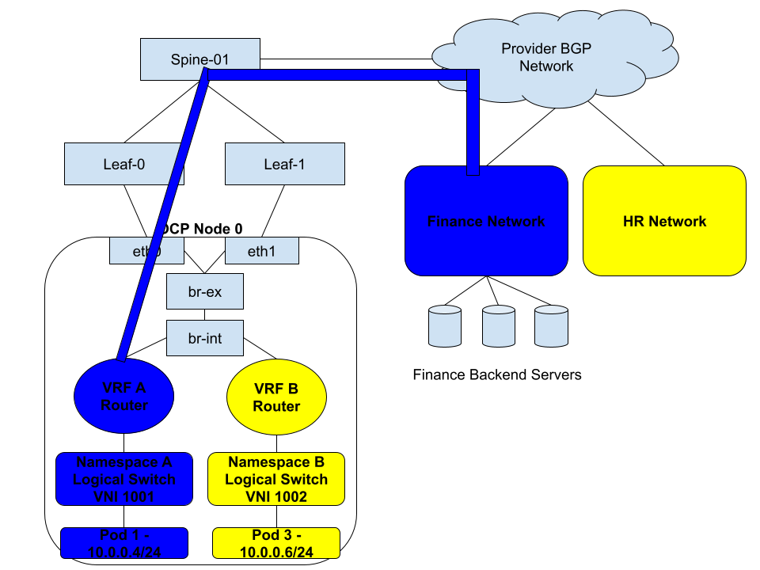
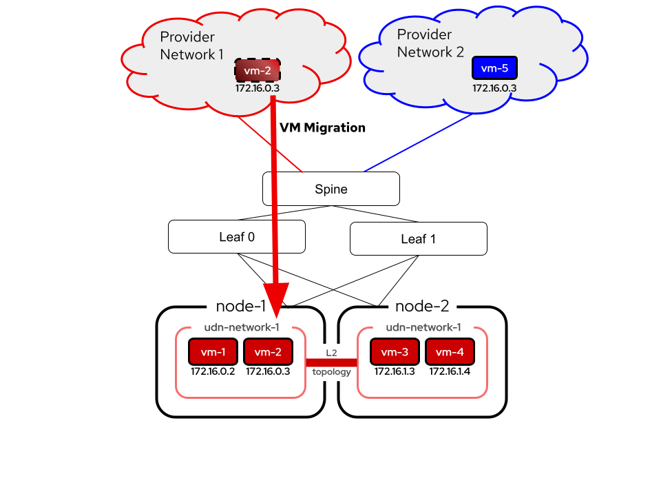

# OVN-Kubernetes EVPN Integration

## Summary

The purpose of this enhancement is to add support for EVPN within the OVN-Kubernetes SDN, specifically with BGP. This
effort will allow exposing User Defined Networks (UDNs) externally via a VPN to other entities either
inside, or outside the cluster. BGP+EVPN is a common and native networking standard that will enable integration into
a user's networks without SDN specific network protocol integration, and provide an industry standardized way to achieve
network segmentation between sites.

## Motivation

The BGP feature has been implemented in OVN-Kubernetes, which allows a user expose pods and other internal Kubernetes
network entities outside the cluster with dynamic routing. Additionally, the User Defined Network (UDN) feature has
brought the capability for a user to be able to create per tenant networks. Combining these features today allows a user
to either:
 - BGP advertise the Cluster Default Network (CDN) as well as leak non-IP-overlapping UDNs into default VRF.
 - Expose UDNs via BGP peering over different network interfaces on an OCP node, allowing a VPN to be terminated on the
   next hop PE router, and preserved into the OCP node. Also known in the networking industry as VRF-Lite.

While VRF-Lite allows for a UDN to be carried via a VPN to external networks, it is cumbersome to configure and requires
an interface per UDN to be available on the host. By leveraging EVPN, these limitations no longer exist and all UDNs can
traverse the same host interface, segregated by VXLAN. Furthermore, with exposing UDNs via BGP today there is a limitation
that these networks are advertised as an L3 segment. With EVPN, we can now stretch the L2 UDN segment across the external
network fabric. Finally, EVPN is a common datacenter networking fabric that many users with Kubernetes clusters already
rely on for their top of rack (TOR) network connectivity. It is a natural next step to enable the Kubernetes platform
to be able to directly integrate with this fabric directly.

### User Stories

The user stories will be broken down into more detail in the subsections below. The main use cases include:
* As a user, I want to connect my Kubernetes cluster to VMs or physical hosts on an external network. I want tenant
  pods/VMs inside my Kubernetes cluster to be able to only communicate with certain network segments on this external
  network.
* As a user, I want to be able to live migrate VMs from my external network onto the Kubernetes platform.
* As a user, my data center where I run Kubernetes is already using EVPN today. I want to eliminate the use of Geneve
  which causes double encapsulation (VXLAN and Geneve), and integrate natively with my networking fabric.
* As a user, I want to create overlapping IP address space UDNs, and then connect them to different external networks
while preserving network isolation.

#### Extending UDNs into the provider network via EVPN

This use case is about connecting a Kubernetes cluster to one or more external networks and preserving the network
isolation of the UDN and external virtual routing and forwarding instances (VRFs) segments. Consider the following
diagram:

In this example a user has traditional Finance and HR networks. These networks are in their own VRFs, meaning they are
isolated from one another and are unable to communicate or even know about the other. These networks may overlap in IP
addressing. Additionally, the user has a Kubernetes cluster where they are migrating some traditional servers/VMs
workloads over to the Kubernetes platform. In this case, the user wants to preserve the same network isolation they had
previously, while also giving the Kubernetes based Finance and HR tenants connectivity to the legacy external networks.

By combining EVPN and UDN this becomes possible. The blue Finance network UDN is created with the Kubernetes cluster, and
integrated into the user's EVPN fabric, extending it to the traditional Finance external network. The same is true for
the yellow HR network. The Finance and HR network isolation is preserved from the Kubernetes cluster outward to the
external networks.

#### Extending Layer 2 UDNs into the provider network to allow VM migration

Building upon the previous example, the network connectivity between a UDN and an external network can be done using
either Layer 3 (IP-VRF) or Layer 2 (MAC-VRF). With the former, routing occurs between entities within the Kubernetes
UDN and the corresponding external network, while with the latter, the UDN and the external network are both part of the
same layer 2 broadcast domain. VM migration relies on being a part of the same L2 segment in order to preserve MAC
address reachability as well as IP address consistency. With MAC-VRFs and EVPN it becomes possible to extend the
layer 2 network between the kubernetes cluster and outside world:

The image above depicts a Layer 2 UDN which not only exists across the worker nodes node-1 and node-2 but is also stretched
into Provider Network 1. In this scenario, vm-2 is able to migrate into node-1 on the UDN network, preserving the same IP
address it had in the external provider network. Similarly, there is another Provider Network 2 which may or may not
correspond to another UDN within the Kubernetes cluster. However, notice that the red and blue networks are both using
the same IP addressing scheme and sharing the same hardware, however due to VRF isolation they are completely unaware and
unable to communicate with each other.

#### Using EVPN as the Overlay for Tenant Networks

With integrating into a customer's already exising TOR spine and leaf architecture, Geneve can be disabled, and network
segmentation will still persist for east/west traffic due to VXLAN tunnels with EVPN. This is true for both IP-VRFs,
and  MAC-VRFs. This reduces packet overhead for customers, while also providing some other advantages that come with
EVPN, such as link redundancy and broadcast, unknown unicast, and multicast (BUM) traffic suppression.

### Goals

* To provide a user facing API to allow configuration of EVPN on Kubernetes worker nodes to integrate with a provider's
  EVPN fabric.
* EVPN support will be provided for Layer 2 (MAC-VRF) or Layer 3 (IP-VRF) OVN-Kubernetes Primary User Defined Network 
  types.
* EVPN Multi-Homing + Mass Withdrawal support, including BFD support for link detection.
* FRR providing EVPN connectivity via BGP and acting as the Kubernetes worker node PE router.
* Support for EVPN in local gateway mode only.
* Support for EVPN in on-prem deployments only.

### Non-Goals

* Providing EVPN support for Secondary User Defined Network types. This may come in a later enhancement.
* Providing support for any other virtual router as a PE router.
* Asymmetric Integrated Routing and Bridging (IRB) with EVPN

### Future-Goals

* Support for EVPN in shared gateway mode once there is OVN support.
* Potential cloud platform support.

## Proposal

EVPN will continue to build upon the BGP support already implemented into OVN-Kubernetes using FRR. This support includes
integration with an OVN-Kubernetes API as well as an FRR-K8S API for configuring BGP peering and routing for UDNs. FRR
already supports EVPN and similar API resources will be leveraged to accomplish configuring FRR as the BGP/EVPN control
plane. A new EVPN CRD will be introduced as the API necessary to enable EVPN for a cluster and selected UDNs.

FRR's implementation relies on specific Linux constructs in order to use EVPN:

1. A VRF device
2. Linux Bridge enslaved to the VRF
3. An SVI attached to the bridge (in most cases)
4. A VXLAN device enslaved to the bridge
5. A VTEP IP configured locally (generally on a loopback interface)

These objects are required to be configured to interoperate with FRR EVPN, and therefore this enhancement proposes a new
operator that will be used to manage objects 2-5. The VRF itself will be managed by OVN-Kubernetes as it is already
created as part of the UDN itself. Furthermore, due to the reliance of FRR on these Linux devices, there is no current
way to natively integrate the data path of EVPN into OVN/OVS. This may change in the future, but for now all traffic
needs to traverse the Linux Kernel Networking stack. Due to this constraint, this enhancement proposes EVPN support only
for local gateway mode.

### Workflow Description

Tenants as well as admins are able to create UDNs for their namespace, however it requires admin access to be able to
configure BGP and expose UDNs over BGP. This trend will continue with EVPN, where it will require admin access in order
to enable EVPN for one or more UDNs. A typical workflow will be:

1. Configure BGP peering via interacting with the FRR-K8S API for a given set of worker nodes.
2. Create a primary Layer 2 or Layer 3 UDN.
3. Configure EVPN CR to enable EVPN for this UDN.

### API Extensions

FRR-K8S may need to be extended to allow for configuring specific EVPN FRR configuration. A new CRD for EVPN will be
created within OVN-Kubernetes.

### Topology Considerations

#### Hypershift / Hosted Control Planes

N/A

#### Standalone Clusters

Proper BGP configuration on the customer side will need to be done on the data center leaf switches. Additionally, for
multi-homing, there should be multiple NIC connections to the Kubernetes worker node with multiple BGP peering sessions
configured.

#### Single-node Deployments or MicroShift

N/A

### Risks and Mitigations

