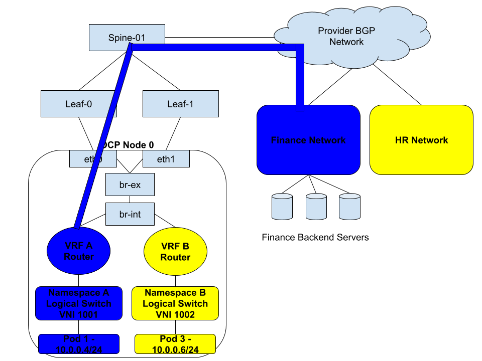

# OVN-Kubernetes EVPN Integration

## Summary

The purpose of this enhancement is to add support for EVPN within the OVN-Kubernetes SDN, specifically with BGP. This
effort will allow exposing User Defined Networks (UDNs) externally via a VPN to other entities either
inside, or outside the cluster. BGP+EVPN is a common and native networking standard that will enable integration into
a user's networks without SDN specific network protocol integration, and provide an industry standardized way to achieve
network segmentation between sites.

## Motivation

The BGP feature has been implemented in OVN-Kubernetes, which allows a user expose pods and other internal Kubernetes
network entities outside the cluster with dynamic routing. Additionally, the User Defined Network (UDN) feature has
brought the capability for a user to be able to create per tenant networks. Combining these features today allows a user
to either:
 - BGP advertise the Cluster Default Network (CDN) as well as leak non-IP-overlapping UDNs into default VRF.
 - Expose UDNs via BGP peering over different network interfaces on an OCP node, allowing a VPN to be terminated on the
   next hop PE router, and preserved into the OCP node. Also known in the networking industry as VRF-Lite.

While VRF-Lite allows for a UDN to be carried via a VPN to external networks, it is cumbersome to configure and requires
an interface per UDN to be available on the host. By leveraging EVPN, these limitations no longer exist and all UDNs can
traverse the same host interface, segregated by VXLAN. Furthermore, with exposing UDNs via BGP today there is a limitation
that these networks are advertised as an L3 segment. With EVPN, we can now stretch the L2 UDN segment across the external
network fabric. Finally, EVPN is a common datacenter networking fabric that many users with Kubernetes clusters already
rely on for their top of rack (TOR) network connectivity. It is a natural next step to enable the Kubernetes platform
to be able to directly integrate with this fabric directly.

### User Stories

The user stories will be broken down into subsections below. The main use cases include:
* As a user, I want to connect my Kubernetes cluster to VMs or physical hosts on an external network. I want tenant
  pods/VMs inside my Kubernetes cluster to be able to only communicate with certain network segments on this external
  network.
* As a user, I want to be able to live migrate VMs from my external network onto the Kubernetes platform.
* As a user, my data center where I run Kubernetes is already using EVPN today. I want to eliminate the use of Geneve
  which causes double encapsulation (VXLAN and Geneve), and integrate natively with my networking fabric.
* As a user, I want to create overlapping IP address space UDNs, and then connect them to different external networks
while preserving network isolation.

#### Extending UDNs into the provider network via EVPN

This use case is about connecting a Kubernetes cluster to one or more external networks and preserving the network
isolation of the UDN and external virtual routing and forwarding instances (VRFs) segments. Consider the following
diagram:

In this example a user has traditional Finance and HR networks. These networks are in their own VRFs, meaning they are
isolated from one another and are unable to communicate or even know about the other. These networks may overlap in IP
addressing. Additionally, the user has a Kubernetes cluster where they are migrating some traditional servers/VMs
workloads over to the Kubernetes platform. In this case, the user wants to preserve the same network isolation they had
previously, while also giving the Kubernetes based Finance and HR tenants connectivity to the legacy external networks.

By combining EVPN and UDN this becomes possible. The blue Finance network UDN is created with the Kubernetes cluster, and
integrated into the user's EVPN fabric, extending it to the traditional Finance external network. The same is true for
the yellow HR network. The Finance and HR network isolation is preserved from the Kubernetes cluster outward to the
external networks.

#### Extending Layer 2 UDNs into the provider network to allow VM migration

Building upon the previous example, the network connectivity between a UDN and an external network can be done using
either Layer 3 (IP-VRF) or Layer 2 (MAC-VRF). With the former, routing occurs between entities within the Kubernetes
UDN and the corresponding external network, while with the latter, the UDN and the external network are both part of the
same layer 2 broadcast domain. VM migration relies on being a part of the same L2 segment in order to preserve MAC
address reachability as well as IP address consistency. With MAC-VRFs and EVPN it becomes possible to to extend the
layer 2 network between the kubernetes cluster and outside world.

